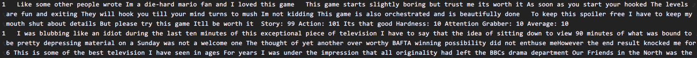

## Text-classification 预训练电影评论情感分类
基于pytorch，使用glove+LSTM来进行文本二分类  

## 环境
* python3
* pytorch 1.4.0

## 目录

``` 
D:.
│  .gitignore
│  Config.py
│  list.txt
│  model_train.py
│  predict.py
│  preprocess.py
│  README.md
│  sentiment_analysis_model.py
│  visualization.ipynb
│  
├─.idea
│  │  .gitignore
│  │  misc.xml
│  │  modules.xml
│  │  Multilingual_SA_word2vec.iml
│  │  vcs.xml
│  │  workspace.xml
│  │  
│  └─inspectionProfiles
│          profiles_settings.xml
│          Project_Default.xml
│          
├─data
│  │  sgns.sogounews.bigram-char
│  │  
│  └─glove.6B.100d
│          vec.txt
│          
├─Dataset
│      baidu_zh_token.txt
│      eng_train.txt
│      eng_validation.txt
│      zh_train_data.txt
│      zh_validation_data.txt
│      
├─log
│      eng_BiLSTM.log
│      zh_BiLSTM.log
│      
├─model
│      eng_BiLSTM.pth
│      zh_BiLSTM.pth
│      
├─README
│      img.png
│      
├─save
│  ├─eng_BiLSTM
│  │      train_acc.npy
│  │      val_acc.npy
│  │      
│  └─zh_BiLSTM
│          train_acc.npy
│          val_acc.npy
│          
└─__pycache__
        Config.cpython-37.pyc
        preprocess.cpython-37.pyc
        sentiment_analysis_model.cpython-37.pyc

```
## 模型
sentiment_analysis_model.py 内有三个模型TextNN, BiLSTM, LSTM-Attention

## 数据集
  训练集：包含2W条左右英文电影评论，其中正负向评论各1W条左右；
  验证集：包含6K条左右英文电影评论，其中正负向评论各3K条左右； 
  测试集：包含360条左右中文电影评论，其中正负向评论各180条左右。  

## 结果
 模型  | Acc
 eng_LSTM | 0.878560

## 使用方法
###数据准备
将经过分词的训练集以及测试集放在Dataset文件夹 格式如下

每一行首先是标签，制表符，然后是分好词的文本。
### 超参数调节
Config.py内调节 train_path validation_path test_path epoch embed_size num_hiddens batch_size  momentum  num_layers
lr等参数。
### 模型保存
日志文件保存为save文件夹 模型文件保存于model文件夹